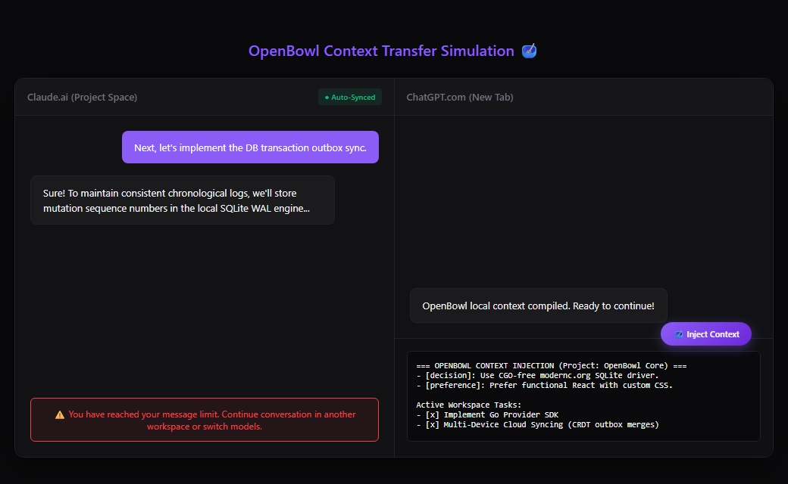
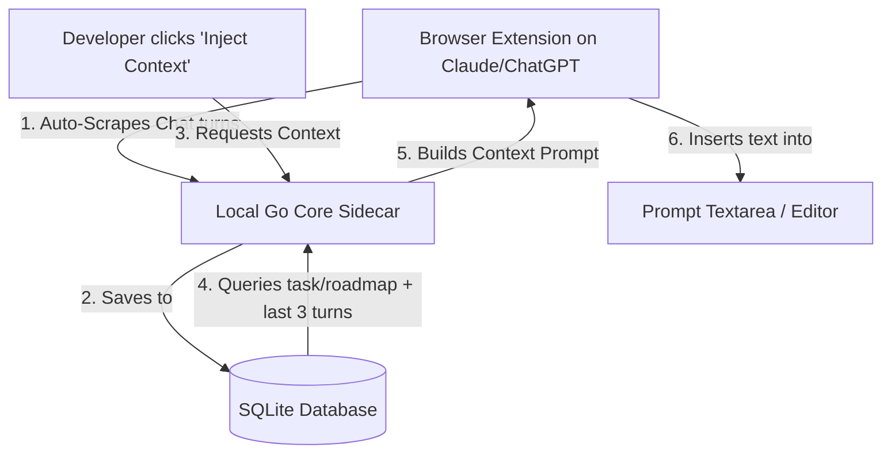
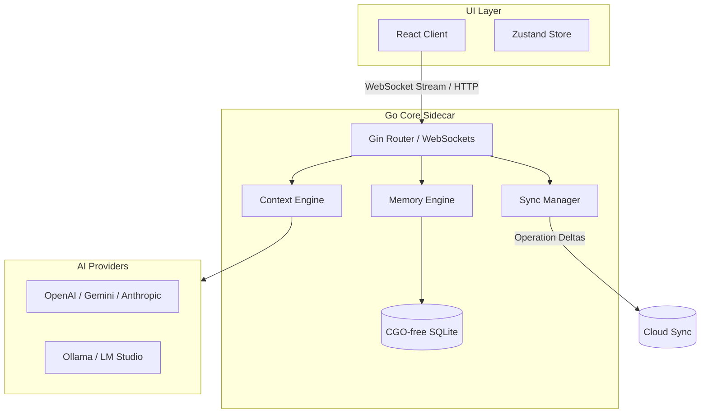
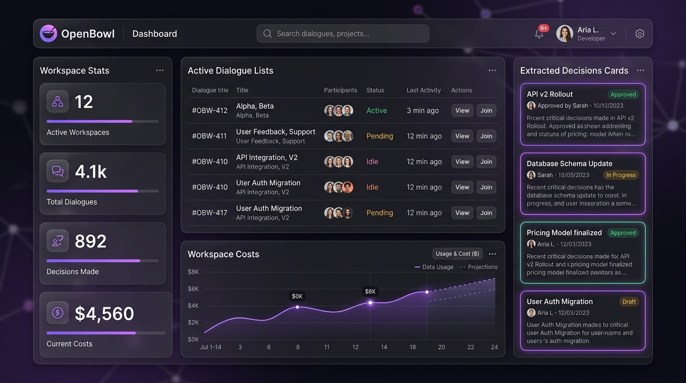
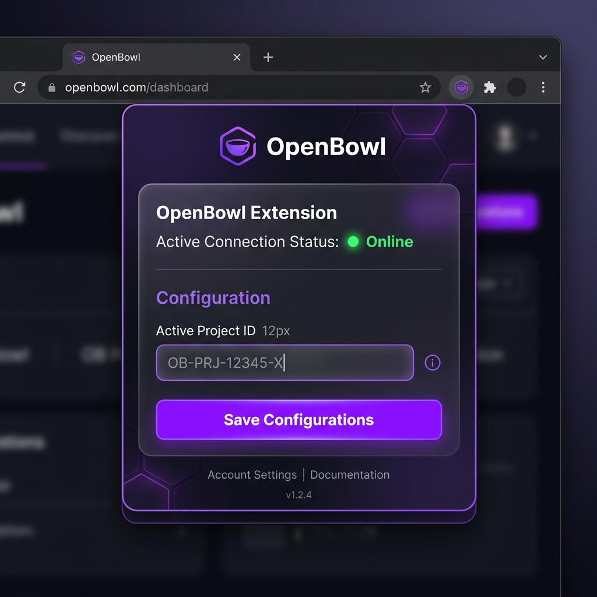

# OpenBowl 🥣

<p align="center">
  
</p>

<p align="center">
  <strong>The Universal Context Layer for AI. Never restart an AI conversation again.</strong>
</p>

<p align="center">
  AI assistants are incredibly smart, but they suffer from goldfish memory. Every time you switch providers, exhaust daily Claude tokens, or open a new chat session, you lose your context. You are forced to copy-paste chat histories, re-upload schemas, and repeatedly explain your architectural rules. 
  <br/><br/>
  <strong>OpenBowl changes this.</strong> By running a silent local sidecar server and a lightweight browser extension, OpenBowl automatically extracts your project tasks, architectural decisions, and active dialogue in real-time, injecting them seamlessly whenever you switch models. Providers become replaceable generators; you own the context.
</p>

<p align="center">
  <a href="#github-stars"></a>
  <a href="#github-forks"></a>
  <a href="LICENSE"></a>
  <a href="#github-issues"></a>
  <a href="#prs-welcome"></a>
  <a href="#model-context-protocol-mcp"></a>
  <a href="#roadmap"></a>
  <a href="https://discord.gg/openbowl"></a>
  <a href="#build-status"></a>
</p>

---

## 🔄 Visual Flow

```
   [ Claude Chat ] ───────> (Message Limit Reached)
          │
          ▼  (Auto-Synced silently in the background)
   [ OpenBowl Local DB ] ─> (Extracts tasks, memories, and last 3 turns)
          │
          ▼  (Click "Inject Context" button)
  [ ChatGPT New Chat ] ───> Continue prompt flow instantly (Zero copy-paste!)
```

---

## 📺 Demo



---

## ❓ Why OpenBowl?

- **The Token Limit Block**: You are in the middle of a complex refactoring on Claude, and suddenly: _You've reached your message limit._ You want to switch to ChatGPT, but you dread re-explaining the file structures and explaining the past three coding attempts.
- **Isolated Conversations**: Chat history is locked inside individual provider silos. ChatGPT does not know what you decided on Claude, and Gemini has no idea what tasks are completed.
- **Goldfish Memory**: Large context windows are expensive and slow. Flooding the prompt window with the entire chat history degrades model reasoning performance over time.

### **The OpenBowl Solution**

OpenBowl acts as the **universal context layer** beneath your browsers and IDEs.

- It runs locally and **privately** on your computer.
- It captures your conversation turns **automatically** as you chat.
- When you switch models, it doesn't dump the whole chat log. Instead, it injects a **dense prompt package** containing your active tasks, architectural decisions, and only the **last 3 turns** of your conversation.

---

## 📊 Feature Comparison & Compatibility

### Feature Comparison

| Feature                    |        OpenBowl 🥣         |  ChatGPT Plus Memory  |   Raw Chat Exports   |
| :------------------------- | :------------------------: | :-------------------: | :------------------: |
| **Multi-Provider Sync**    |          **Yes**           |   No (OpenAI only)    |   No (Static logs)   |
| **Auto Background Sync**   | **Yes** (MutationObserver) |          Yes          | No (Manual download) |
| **Sliding Window Buffer**  | **Yes** (Last 6 messages)  | No (Exhausts context) |          No          |
| **Local-First & Private**  |  **Yes** (WAL SQLite DB)   |   No (OpenAI Cloud)   |   Yes (JSON files)   |
| **Workspace File Watcher** |          **Yes**           |          No           |          No          |
| **IDE Integration (MCP)**  |  **Yes** (Cursor/VS Code)  |          No           |          No          |

### Browser Compatibility

| Browser           | ChatGPT (`chatgpt.com`) | Claude (`claude.ai`) |          Input Box Selectors           | Status      |
| :---------------- | :---------------------: | :------------------: | :------------------------------------: | :---------- |
| **Google Chrome** |           Yes           |         Yes          | `#prompt-textarea` / `contenteditable` | **Stable**  |
| **Brave**         |           Yes           |         Yes          | `#prompt-textarea` / `contenteditable` | **Stable**  |
| **Arc**           |           Yes           |         Yes          | `#prompt-textarea` / `contenteditable` | **Stable**  |
| **Firefox**       |         Planned         |       Planned        |                   -                    | **Roadmap** |
| **Safari**        |         Planned         |       Planned        |                   -                    | **Roadmap** |

---

## ✨ Features

### 🎯 Context Continuity

- **Sliding Window Buffer**: Pastes only the last 6 messages (3 conversation turns) so the model knows the immediate conversation flow without cluttering your input box or wasting prompt tokens.
- **Prompt Packager**: Builds a token-efficient system state containing workspace goals, file reference snippets, and project rules.

### 🧠 Memory Engine

- **Fact Extraction (Under Development)**: Background Go routines scan conversations to isolate structural facts ("We use SQLite in WAL mode") and preferences ("Prefer functional React components").
- **Local SQLite Storage**: Saves your workspace history, configurations, and tasks in a fast, WAL-enabled, CGO-free SQLite database.

### 🛡️ Privacy & Local-First

- **Zero Telemetry**: All data remains on your machine. API keys are managed locally and requests bypass intermediate cloud relays.
- **Offline-First Synchronization**: Maintains a transactional local outbox to safely merge configuration mutations when syncing between devices.

### 🔌 Universal Providers

- **Provider SDK**: Abstract parameter, payload, and streaming API differences between Anthropic, OpenAI, Gemini, Groq, Ollama, and LM Studio.

### 💻 Developer Experience

- **Floating Injector UI**: A lightweight button injected on ChatGPT and Claude handles DOM focus and text insertion instantly.
- **Silent OS Startup**: Run backend sidecars invisibly on Windows log-on using native background launcher scripts.
- **Robust E2E Tests**: Fully automated Playwright test suite loads the extension unpacked, mocks LLM page DOMs, and asserts storage persistence.

---

## ⚙️ How it Works



---

## 🏗️ Architecture

OpenBowl runs a local hybrid architecture to ensure maximum performance and platform-independent execution:



- **Frontend**: The React client interface (Web / Desktop shell).
- **Backend (Go Core Sidecar)**: Local Gin router exposing port `3010` endpoints to ingest extension payloads, compile structured markdown context, and stream WebSocket events.
- **Memory Engine**: Background parser mapping entries to SQLite tables.
- **Provider Layer**: Unified adapter interface mapping messages to Anthropic/OpenAI/Gemini APIs.
- **Browser Extension**: Script injected on `chatgpt.com` and `claude.ai` pages that manages DOM scraping, auto-sync calls, and context field population.
- **Local Database**: WAL-enabled SQLite database holding workspaces, projects, tasks, memories, and message threads.

---

## 🔌 Supported Providers

| Provider               | Supported | Status  | Notes                                            |
| :--------------------- | :-------: | :-----: | :----------------------------------------------- |
| **Anthropic (Claude)** |    Yes    | Stable  | Context Injection & Auto-Sync fully operational  |
| **OpenAI (ChatGPT)**   |    Yes    | Stable  | Context Injection & Auto-Sync fully operational  |
| **Gemini**             |    Yes    | Planned | Direct API support ready; Extension hook planned |
| **Groq**               |    Yes    | Stable  | Core API support active                          |
| **Ollama**             |    Yes    | Stable  | Local model integration active                   |
| **LM Studio**          |    Yes    | Stable  | Local model integration active                   |

---

## 🚀 Installation

### Quick Start (Windows Setup)

We have automated the compilation and startup configuration so the Go backend runs silently in the background on every login.

1. Clone the repository:
   ```bash
   git clone https://github.com/openbowl/openbowl.git
   cd openbowl
   ```
2. Run the startup installation script:
   ```powershell
   powershell -ExecutionPolicy Bypass -File .\scripts\install-startup.ps1
   ```
3. Load the Extension in Chrome:
   - Open **`chrome://extensions/`**.
   - Enable **Developer mode** (top-right).
   - Click **Load unpacked** (top-left) and select the **`apps/extension`** folder.

---

### Manual Development Setup

If you prefer to run the components manually:

#### 1. Start the Go Backend Server

```bash
# From root directory
go run packages/core/cmd/server/main.go
```

_The local server starts hosting endpoints on `http://localhost:3010`._

#### 2. Run the React Web UI

```bash
npm run dev --prefix apps/web
```

_The web client launches on `http://localhost:3000`._

---

## 📖 Usage

1. **Configure your Project**: Click the OpenBowl extension icon in your Chrome toolbar. Set your active Project ID (e.g. `proj-core-default`) and click **Save**.
2. **Chat Naturally**: Open Claude or ChatGPT and begin your research or coding session. The extension will automatically capture and sync your dialogue turns in the background.
3. **Switch Providers**: When switching tabs, click the floating **🥣 Inject Context** button on the page. Your active goals, architectural rules, and recent dialogue turns are instantly injected into the prompt box.
4. **Continue Chatting**: Press send, and continue the conversation seamlessly!

### ⌨️ Keyboard Shortcuts (Roadmap)

- **`Alt + C`**: Force sync conversation turn manually.
- **`Alt + I`**: Inject Context into prompt textarea immediately.
- **`Ctrl + Shift + P`**: Open OpenBowl Command Palette settings.

---

## 🔌 Model Context Protocol (MCP)

OpenBowl implements a native **MCP JSON-RPC 2.0 stdio server** that allows IDEs like **Cursor** or **VS Code** to directly read your workspace context (tasks, memories, decisions, and files) so your editor's agent always stays in sync.

### Configure in Cursor / VS Code:

1. Open your IDE's MCP settings.
2. Add a new MCP Server:
   - **Name**: `OpenBowl`
   - **Type**: `command`
   - **Command**: `D:\Projects\OpenBowl\bin\openbowl-server.exe --mcp` (or path to your built binary)
3. **Exposed Tools**:
   - `list_workspace_memories`: Retrieve active architectural decisions and user preferences.
   - `list_workspace_tasks`: Retrieve the task board and checklist statuses.
   - `list_workspace_files`: Retrieve the files indexed by the workspace file watcher.

---

## 🖼️ Screenshots

### Dashboard



### Browser Extension



### Context Viewer

<!-- Screenshot -->

_Screenshot placeholder — Context compiler preview coming soon!_

---

## 🗺️ Roadmap

- [x] Browser Extension (Manifest V3)
- [x] Local WAL SQLite Database
- [x] Real-time Extension Auto-sync (MutationObserver)
- [x] Sliding Window Context continuation (Last 6 messages)
- [x] Model Context Protocol (MCP) Server integrations
- [ ] Desktop Application (Tauri Window Wrapper)
- [ ] VS Code / Cursor IDE Extension
- [ ] Semantic Vector Search (Local ONNX embeddings)
- [ ] Multi-Device Cloud Syncing (CRDT merges)
- [ ] Background AI Fact & Todo Extraction agents

---

## 🤝 Contributing

We welcome contributions of all sizes! To maintain codebase quality:

- **Good First Issues**: Look for issues tagged `good-first-issue` to get started.
- **RFCs & Feature Requests**: Open an issue to discuss design proposals before writing code.
- **Development Flow**: Read the **[Contributor Guide](file:///D:/Projects/OpenBowl/docs/CONTRIBUTING.md)** for branch naming formats, TypeScript rules, and code standards.

### Contributors

<a href="https://github.com/openbowl/openbowl/graphs/contributors">
  
</a>

---

## 📑 Documentation

- 📄 **[CONTEXT_ENGINE.md](file:///D:/Projects/OpenBowl/docs/CONTEXT_ENGINE.md)**: Context engine mechanics & sliding window compaction.
- 📄 **[openapi.yaml](file:///D:/Projects/OpenBowl/docs/openapi.yaml)**: OpenAPI/Swagger specification of local REST endpoints.
- 📄 **[SECURITY.md](file:///D:/Projects/OpenBowl/docs/SECURITY.md)**: OpenBowl security standards, API credentials protection, and file permissions.
- 📄 **[ARCHITECTURE.md](file:///D:/Projects/OpenBowl/docs/ARCHITECTURE.md)**: System design and Tauri integration.
- 📄 **[API_DESIGN.md](file:///D:/Projects/OpenBowl/docs/API_DESIGN.md)**: REST interfaces and WebSocket event payloads.
- 📄 **[DATA_MODEL.md](file:///D:/Projects/OpenBowl/docs/DATA_MODEL.md)**: Database schemas and indexing strategy.
- 📄 **[PRD.md](file:///D:/Projects/OpenBowl/docs/PRD.md)**: Project scope and milestones criteria.

---

## 💬 FAQ

### Why not just use ChatGPT's built-in Memory?

ChatGPT's memory is siloed within OpenAI. It cannot transfer to Claude, Groq, or Ollama. OpenBowl is completely vendor-agnostic and runs local-first, keeping you in control of your memory context.

### Does OpenBowl store my conversation data in the cloud?

No. OpenBowl is local-first. Your API keys, workspace files, and conversation histories are stored entirely in a local SQLite database on your computer.

### How does the sliding window context prevent prompt bloat?

Instead of dumping hours of conversation history into the model, the backend fetches only your last 3 dialog turns (6 messages). This is enough to maintain conversation continuity while leaving context windows clean and fast.

---

## 🏛️ Philosophy

- **Context Ownership**: The workspace belongs to the user, not the model provider.
- **Provider Agnosticism**: Switching models should require zero data migration.
- **Local First**: Your memories are private. They belong on your hard drive, not in a server farm.
- **Open Source**: Built transparently for developers, by developers.

---

## 📄 License

This project is licensed under the MIT License - see the [LICENSE](LICENSE) file for details.
