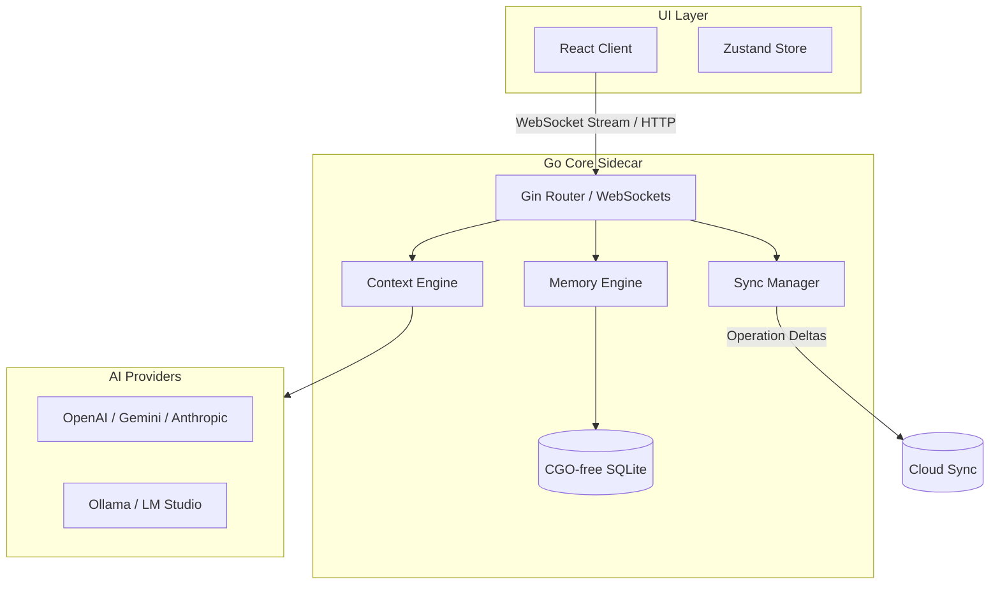

# OpenBowl 🥣

[](https://golang.org/)
[](https://www.typescriptlang.org/)
[](https://react.dev/)
[](https://tauri.app/)
[](LICENSE)

> OpenBowl is the **universal context layer for AI**. It allows users to continue work seamlessly between ChatGPT, Claude, Gemini, Grok, DeepSeek, Ollama, and LM Studio without losing their state, task lists, or structural workspace memory.

In OpenBowl, **the application owns the memory**, and the **providers only generate responses**.

---

## 🚀 Key Features

* **Universal Provider SDK**: Abstract all model differences. Write once, switch instantly. Supports OpenAI, Anthropic, Gemini, Groq, OpenRouter, DeepSeek, Ollama, and LM Studio.
* **Context Engine**: Instead of replaying full chat logs, it compiles a dense prompt package (Workspace goals, active tasks list, active architectural decisions, file reference snippets, and timeline history).
* **Asynchronous Memory Engine**: Background Go workers scan conversation history to extract structured facts, TODOs, user preferences, and decisions, keeping the prompt context dense and token-efficient.
* **Offline-First operation Sync**: Records mutations in a transactional local outbox. Synchronizes delta changes (e.g. "completed task", "updated preference") with the cloud using Last-Write-Wins (LWW) conflict merges.
* **Model Context Protocol (MCP)**: Implements native MCP JSON-RPC 2.0 stdio protocols, allowing IDE clients (like Cursor or VS Code) to query the local OpenBowl workspace database.
* **Import/Export engine**: Import standard ChatGPT backup `conversations.json` tree logs, translating the nodes into linear DB entities.

---

## 📐 System Architecture

OpenBowl runs a local hybrid architecture to ensure maximum performance and platform-independent execution:



---

## 🛠️ Tech Stack

* **Frontend**: React, TypeScript, Vite, Tailwind CSS, TanStack Query, Zustand
* **Desktop Shell**: Tauri (Rust binding wrapper)
* **Local Backend Sidecar**: Go, Gin, WebSockets, pure-Go SQLite (`modernc.org/sqlite`)
* **Testing**: Go Test Suite, Playwright, Vitest

---

## ⚡ Quick Start

### Prerequisites

Make sure you have the following installed on your machine:
* **Node.js** (v18+)
* **Go** (v1.21+)

---

### Installation

1. **Clone the repository**:
   ```bash
   git clone https://github.com/openbowl/openbowl.git
   cd openbowl
   ```

2. **Install Frontend Dependencies**:
   ```bash
   npm install --prefix apps/web
   ```

3. **Verify the Go Backend Modules**:
   ```bash
   cd packages/core
   go test -v ./...
   ```

---

### Running the Project

To start development server processes:

1. **Start the Go Sidecar Backend**:
   ```bash
   # From root directory
   go run packages/core/cmd/server/main.go
   ```
   *The local server starts hosting endpoints and websockets on `http://localhost:3010`.*

2. **Start the React Frontend Client**:
   ```bash
   npm run dev --prefix apps/web
   ```
   *The web client launches on `http://localhost:3000`.*

---

## 🧪 Running Tests

OpenBowl maintains strict test coverage requirements. Run tests across the workspace:

```bash
# Run all Go engine test suites
go test -v ./packages/core/...
```

---

## 📂 Codebase Structure

For detailed architecture descriptions, refer to the [docs/](file:///D:/Projects/OpenBowl/docs) directory:
* 📄 **[PRD.md](file:///D:/Projects/OpenBowl/docs/PRD.md)**: Product goals & milestones success criteria.
* 📄 **[ARCHITECTURE.md](file:///D:/Projects/OpenBowl/docs/ARCHITECTURE.md)**: Key design decisions (ADR) and Tauri configurations.
* 📄 **[DATA_MODEL.md](file:///D:/Projects/OpenBowl/docs/DATA_MODEL.md)**: Database schemas and indexing strategy.
* 📄 **[API_DESIGN.md](file:///D:/Projects/OpenBowl/docs/API_DESIGN.md)**: JSON-RPC MCP and WebSocket messaging contracts.
* 📄 **[CONTRIBUTING.md](file:///D:/Projects/OpenBowl/docs/CONTRIBUTING.md)**: Developer setup guidelines.

---

## 🤝 Contributing

We welcome contributions of all scopes! Please read our [Contributor Guide](file:///D:/Projects/OpenBowl/docs/CONTRIBUTING.md) to understand local branch naming configurations, strict TypeScript formats, and Pull Request checklists.

---

## 📄 License

This project is licensed under the MIT License - see the [LICENSE](LICENSE) file for details.
