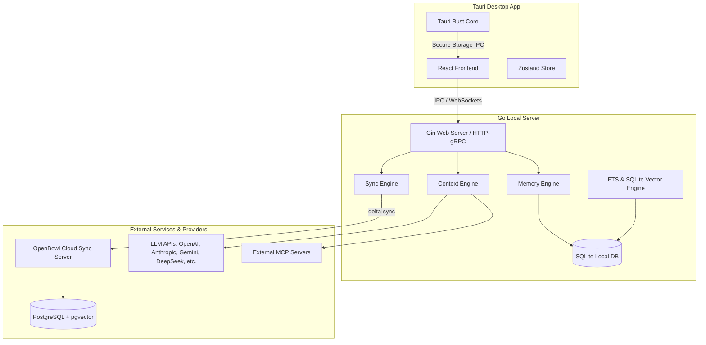

# Software Architecture Document (SAD) - OpenBowl

## 1. System Overview

OpenBowl uses a hybrid, offline-first architecture. It combines a native desktop application shell (Tauri + React) with a robust, lightweight local backend (Go) to handle data orchestration, parsing, synchronization, and local vector indexing.



---

## 2. Key Architecture Decisions (ADR)

### ADR-01: Hybrid Desktop Architecture (Tauri + Go Backend)

- **Context**: We need access to local directories, filesystems, background file watchers, local vector search libraries, and raw socket speeds for MCP. A pure JS/TS app runs into node-native compiled library dependency nightmares and sluggish background parsing. A pure Go app lacks React's rich component ecosystem.
- **Decision**: Use **Tauri** as the window manager and system utility layer. Tauri spawns a local **Go sidecar binary** on startup. The React frontend communicates with the Go sidecar via high-speed WebSockets or HTTP/gRPC.
- **Consequences**: Fast startup times (`< 300ms`), low memory usage (no heavy Electron runtime), and the ability to write CPU-bound tasks (Memory Engine parsing, markdown indexing, operations sync) in Go.

### ADR-02: Offline-First Operation-Based Sync (CRDT-Ready)

- **Context**: The application must run perfectly fine on a plane or train, saving every edit, new task, and provider configuration locally. When coming online, it must reconcile changes with other devices without destroying data or producing sync conflicts.
- **Decision**: We log changes as ordered _Operations_ (events) rather than state snapshots. Operations are stored in local SQLite. On sync, operations are replayed and merged using a Logical Clock (LWW-Element-Set or similar state-based CRDT logic).
- **Consequences**: Clean merge logs, offline support, history replay, and minimized data transfer (syncing metadata operation diffs rather than full message logs).

### ADR-03: Modular Monorepo with Clean Architecture

- **Context**: The codebase must scale from a desktop application to a CLI tool, a mobile shell, and potentially a web dashboard. Code duplication or coupling the UI directly to provider SDKs will halt development speed.
- **Decision**: Implement a strict monorepo layout using `pnpm` workspaces for JS packages, and a clear module system in the Go backend. Go codebase follows Clean Architecture:
  - **Domain Layer**: Core interfaces, entities (Project, Task, Session), and domain errors. No external dependencies.
  - **Use Case Layer**: Business logic (e.g., AssembleContextPackage, ExtractMemories). Depends only on Domain interfaces.
  - **Interface Adapters**: Controller, gRPC handlers, SQLite repositories, external LLM clients.
  - **Infrastructure**: Database connections, Tauri bindings, file-system observers.

---

## 3. Core Engine Specifications

### 3.1 Provider SDK

- **Interface-Driven**: Every provider (e.g., `AnthropicClient`, `GeminiClient`) implements the `Provider` interface:
  ```go
  type Provider interface {
      Completion(ctx context.Context, req *CompletionRequest) (*CompletionResponse, error)
      CompletionStream(ctx context.Context, req *CompletionRequest, stream chan<- *StreamChunk) error
      ListModels() ([]ModelInfo, error)
      ValidateCredentials() error
  }
  ```
- **Payload Unification**: The SDK translates vendor-specific fields (like Gemini's `contents` vs OpenAI's `messages`, system instruction placement, tool definitions) into a generic format.

### 3.2 Context Engine

- **Context Assembler**: Gathers metadata, active source files, global rules, recent task logs, and extracts relevant memory matches.
- **Context Optimizer**: Uses a greedy token budget allocation strategy:
  1. _System Instruction / Rules_ (High priority)
  2. _Active Task & Objectives_ (High priority)
  3. _Recent Chat History_ (Medium priority - dynamically summarized or truncated)
  4. _Retrieved Memory Vectors_ (Low priority - filled up to the remaining budget)
  5. _Referenced File Contents_ (Medium priority - parsed into diff blocks or snippets)
- Outputs a clean, serialized completion request payload.

### 3.3 Memory Engine

- **Worker Queue**: A lightweight background processing queue in Go. When a message is sent or received, it is pushed to the queue.
- **Parser Node**: A specialized prompt (or local small LLM / regex rule engine) parses the message for declarations, actions, and facts.
- **Storage Protocol**: Items are mapped into the `memories` table with category tags (e.g., `architecture`, `todo`, `preference`).

### 3.4 Sync Engine

- **Outbox Pattern**: All mutations write to a local database and append to an `operations_outbox` table.
- **Sync Manager**: Runs a background worker that polls the outbox, batches operations, and pushes them to the remote Sync API endpoint. If offline, the worker retries with exponential backoff.

---

## 4. Security & Privacy

- **Credential Management**: API keys and sync tokens are never written to the SQLite database. They are saved in OS Keychains via Tauri's native plugins (`tauri-plugin-stronghold` or native OS bindings).
- **Local Database**: SQLite database can be optionally encrypted using SQLCipher.
- **Network Isolation**: By default, local LLM queries (Ollama/LM Studio) never leave the local machine. Outbound requests to commercial providers go directly from the client machine to the provider endpoint unless a custom enterprise proxy is configured.
