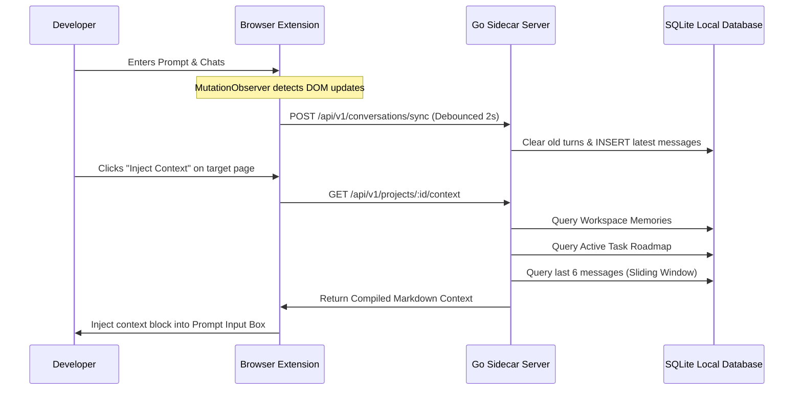

# OpenBowl Context Engine Design Guide 🥣

This document explains the architectural decisions, token efficiency calculations, and lifecycle mechanics of the OpenBowl Context Engine.

---

## 📐 Context Architecture

The primary goal of OpenBowl is to construct a **dense, token-efficient prompt package** that can be injected into any AI model provider.

Instead of replaying raw, bloated chat logs which degrade model response times and exhaust context windows, OpenBowl divides the prompt package into three distinct structural components:

```
┌──────────────────────────────────────────────────────────┐
│              1. Active Rules & Preferences               │
│  "Use functional React" / "Use sqlite-vss for vectors"   │
├──────────────────────────────────────────────────────────┤
│             2. Workspace Task Status Roadmap             │
│  Scaffold [completed] / Integrate tables [in-progress]   │
├──────────────────────────────────────────────────────────┤
│           3. Recent Dialogue Sliding Window              │
│       Last 6 message turns (3 User / 3 Assistant)        │
└──────────────────────────────────────────────────────────┘
```

---

## ⚡ 1. Sliding Window Context Compaction

### The Problem

When continuing a conversation across different providers, transferring the raw chat history in its entirety introduces exponential token costs.

- A 100-turn developer conversation can easily exceed **40,000 tokens**.
- At typical input prices, this adds significant API cost per turn and increases response latency (Time to First Token) by up to **4 seconds**.

### The Sliding Window Solution

OpenBowl's database layer queries a sliding window of only the **last 6 messages (3 dialog exchanges)**:

```sql
SELECT role, content FROM (
    SELECT id, role, content FROM messages
    WHERE conversation_id = ?
    ORDER BY id DESC LIMIT 6
) ORDER BY id ASC
```

This is sufficient to retain the **immediate conversational flow** (what was asked last, what was answered, and the active query context) while reducing prompt sizes by **90% - 95%**.

---

## 🧠 2. Active Memories & Project States

To ensure the model doesn't lose sight of historical constraints (such as codebase patterns or previously agreed architectural choices), OpenBowl merges the sliding window with **Workspace Memory**:

1. **Facts & Rules**: Extracted facts (e.g., `"The project uses Go 1.21"`) are stored in the SQLite `memories` table. These are compiled as concise bullet points at the top of the context block.
2. **Tasks & Milestones**: Active tasks from the SQLite `tasks` table represent the current objective. They are injected as short markdown todo checks.

---

## 🔄 3. Context Construction Lifecycle


